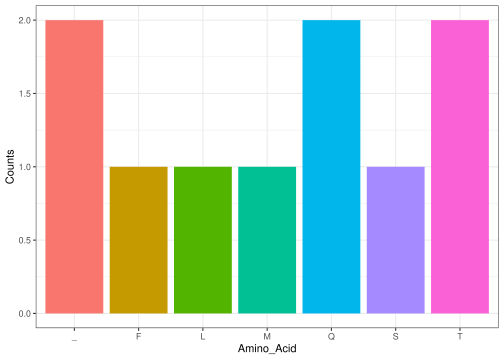

Group02_CentralDogma
================

``` r
library(Group02.CentralDogma)
```

## Functions from the package

### Function 1:

Creates a random DNA-sequence on a given lenght.

``` r
R_DNA_sequence(30)
#> [1] "ACCGTGCAACAATGGAGCTCCTGATAGAGG"
```

### Function 2:

Translates a given DNA-sequence into RNA.

``` r
transcribe_dna_to_rna("TCGTAAACTTAACAAATGCTTACCCAGTTT")
#> [1] "UCGUAAACUUAACAAAUGCUUACCCAGUUU"
```

### Function 3:

Splits a nucleotide base sequence into codons.

``` r
sequence_split("UCGUAAACUUAACAAAUGCUUACCCAGUUU")
#>  [1] "UCG" "UAA" "ACU" "UAA" "CAA" "AUG" "CUU" "ACC" "CAG" "UUU"
```

### Function 4:

Strings together codons into an amino acid sequence.

``` r
a_acid_sequence(c("UCG","UAA","ACU","UAA","CAA","AUG","CUU","ACC","CAG","UUU"))
#> [1] "S_T_QMLTQF"
```

### Function 5:

Returns a ggplot column graph based on the amount of each amino acid
type. This one has two dependencise, being ggplot and stringr.

``` r
plot_amino_acid_counts("S_T_QMLTQF")
```

<!-- -->
