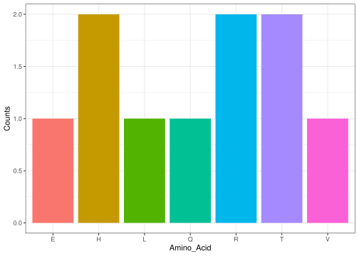

Group02_CentralDogma
================

``` r
library(Group02.CentralDogma)
```

## Functions from the package

### Function 1:

Creates a random DNA-sequence on a given lenght.

``` r
R_DNA_sequence(30)
#> [1] "CCACTAAGCTTGGGAACAAGAGGCGGTGTC"
```

### Function 2:

Translates a given DNA-sequence into RNA.

``` r
transcribe_dna_to_rna("GAGCTACGCCAGAGAACTGTCCACACACAT")
#> [1] "GAGCUACGCCAGAGAACUGUCCACACACAU"
```

### Function 3:

Splits a nucleotide base sequence into codons.

``` r
sequence_split("GAGCUACGCCAGAGAACUGUCCACACACAU")
#>  [1] "GAG" "CUA" "CGC" "CAG" "AGA" "ACU" "GUC" "CAC" "ACA" "CAU"
```

### Function 4:

Strings together codons into an amino acid sequence.

``` r
a_acid_sequence(c("GAG", "CUA", "CGC", "CAG", "AGA", "ACU", "GUC", "CAC", "ACA", "CAU"))
#> [1] "ELRQRTVHTH"
```

\###Function 5: Returns a ggplot column graph based on the amount of
each amino acid type. This one has two dependencise, being ggplot and
stringr.

``` r
plot_amino_acid_counts("ELRQRTVHTH")
```

<!-- --> \## Possible
additions to the package A good addition to the package would be a
logoplot for the sequences.

## Furthermore

It is a good idea to limit the amount of dependencies a package have,
because it can have consequences in the long run if there happens any
updates or the scripts are leaft alone. Sometimes it is needed if the
code is very complicated, but if its possible one should make once own
scripts.

### Differences between importing a package and utilizing one

@importFrom package function: Adds a dependency to the package, and is
for frequent use making the function accessible without prefixing.

package::function(): Is for explicit, occational use without importing
the funciton.
